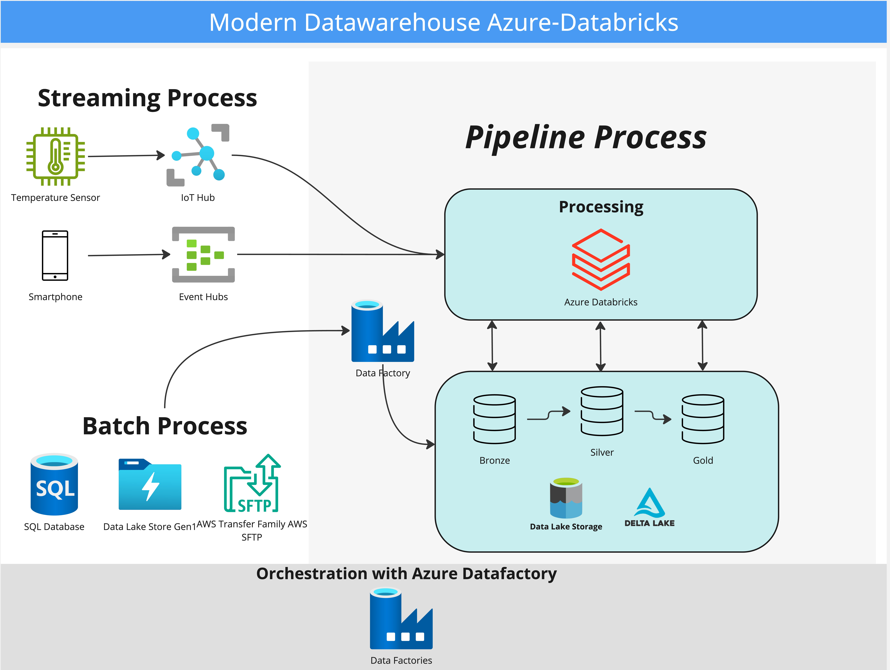

Overview
========
Welcome to the End-to-End Azure Databricks Solution.
This project was created to demonstrate how to use Azure Databricks to create an end-to-end data integration solution.

The solution is based on the following architecture:

Project Contents
================
The project contains the following folders:
* **/notebooks**: Contains the notebooks running in Databricks
* **/src**: Contains the scripts and Python Classes for the notebooks and the Azure Functions.

Contact
=======

Jaime Salas
[LinkedIn](https://www.linkedin.com/in/jaimeandresalas/)